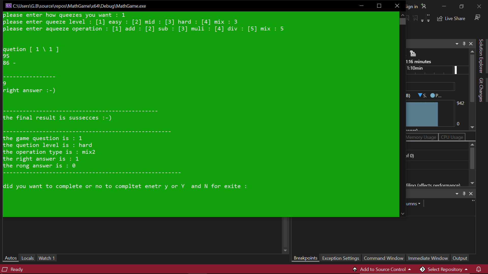
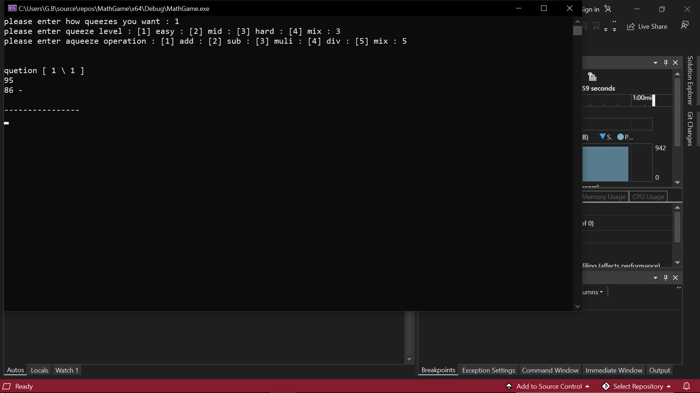

# 🧠 Math Quiz Game in C++ | لعبة تدريب العمليات الحسابية

**لعبة تعليمية تفاعلية بلغة C++ وتقنية الكونسول**  
صُممت خصيصًا لاختبار قدرات اللاعب في الحساب الذهني عبر مستويات صعوبة مختلفة وأنماط متعددة من العمليات الرياضية.

---

## 🎮 فكرة اللعبة

اللعبة تبدأ بسؤالك عن:

1. **عدد الجولات** التي تريد لعبها
2. **مستوى الصعوبة**:
   - 🟢 سهلة → أرقام أقل من 10
   - 🟡 متوسطة → من 10 إلى 50
   - 🔴 صعبة → من 50 إلى 100
3. **نوع العملية الحسابية**:
   - ➕ جمع
   - ➖ طرح
   - ✖️ ضرب
   - ➗ قسمة
   - 🎲 مختلط (عشوائي من الأنواع أعلاه)

ثم تبدأ الجولات، ويُعرض لك في كل جولة **سؤال عشوائي** حسب اختياراتك السابقة.

في نهاية اللعبة، يتم عرض:

- ✅ عدد الإجابات الصحيحة
- ❌ عدد الإجابات الخاطئة
- 📊 النسبة المئوية
- 🏆 النتيجة: **ناجح أو راسب**

---

## 🧠 الميزات

- 📊 دعم نظام مراحل متعدد (سهل، متوسط، صعب)
- 🔢 توليد أرقام وأسئلة عشوائية لكل جولة
- 🧮 عمليات: جمع – طرح – ضرب – قسمة – مختلط
- ✅ احتساب النتيجة تلقائيًا وإظهار النسبة
- 🖥️ واجهة Console تفاعلية وسهلة الاستخدام
- 📁 كود منظم وقابل للتوسعة

---

## 🛠️ التقنيات المستخدمة

| التقنية | الاستخدام |
|---------|------------|
| 💬 C++  | اللغة الأساسية |
| 🎲 `rand()` | لتوليد الأرقام العشوائية |
| 📥 cin / cout | لتفاعل المستخدم |
| 🔄 Loops & Conditions | لتنظيم الجولات والنتائج |

---

## 📸 صور من داخل اللعبة

## ⚙️ طريقة التشغيل

1: افتح المشروع باستخدام محرر C++ مثل Code::Blocks أو Visual Studio أو VS Code.

2: تأكد أن ملف main.cpp موجود في مجلد المشروع.

3: شغّل الملف، واتبع التعليمات على الشاشة:

4: أدخل عدد الجولات

5: اختر مستوى الصعوبة

6: اختر نوع العملية الحسابية

7: أجب على الأسئلة الظاهرة.

8: في النهاية، راح تطلع لك نتيجتك كاملة (كم صح، كم خطأ، ونسبتك).

## ⭐ دعم المشروع

إذا أعجبتك اللعبة أو ساعدتك في تطوير مهاراتك في C++،
اضغط على زر ⭐ لدعمي وتشجيعي على بناء المزيد من المشاريع الممتعة والمفيدة 💙

## 🧑‍💻 المطوّر

تم تطوير هذا المشروع بشغف كوسيلة تعليمية وتدريبية باستخدام لغة C++
ويهدف لمساعدة المتعلمين على اختبار مهاراتهم الحسابية بطريقة ممتعة ومجزية.

💬 هل عندك فكرة أو تحسين؟
افتح Issue أو Pull Request وخلنا نطوّرها سوا!
